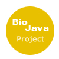
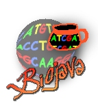

BioJava Needs a Logo
--------------------

The new wiki site calls for a new BioJava logo. If you have ideas for a
new logo then upload your ideas here. As this will be a community
process feel free to make comments on this page about which logos you
prefer. --[Mark](User:Mark "wikilink") 21:28, 1 February 2006 (EST)

Logo Suggestions
----------------

Logo1  Nice but we cannot
incorporate the Sun Java logo, that would need to change.

Logo2  I like this
one.

Logo3 

This is good.

I like this one, but I think the sequence on top and bottom is too
much - can we have the middle part only? I assume the image is in the
copyright of the contributor? [andreas](User:andreas "wikilink")

Logo4 

Logo5  5, 6 and 7 are good but we
would need to modify the cup so that we are not using the Sun Java logo.

Logo6 

Logo7 

Hi Mark and all. I would tend to go with the Zen look of the BioPerl
logo. You are right about the cup as it is right now (deigns 5 to 7), it
looks to much like Sun's. My original idea was to have a DNA helix swirl
out of a steaming cup of hot cocoa ;-) Could we stylized the cup with 0
and 1, a,c,g,t ? --[Foisys](User:Foisys "wikilink") 09:48, 7 February
2006 (EST)

Logo8 

It's a caffeine molecule! --[Rholland](User::Rholland "wikilink") 17:45,
8 February 2006 (SGT)

Logo9 

--[Jordi](User::Jordi "wikilink") 20:31, 9 February 2006 (SGT)

-- Count my vote on this one. An idea: how about removing the blue
circle and inverting colors white to blue. This would keep the logo in
harmony with the background of the page. Just my 2
cents... --[Foisys](User:Foisys "wikilink") 15:00, 16 February 2006
(EST)

Here are some proposals by Ong Swee Hoe from
[http://www.gis.a-star.edu.sg
GIS](http://www.gis.a-star.edu.sg GIS "wikilink") in
[Singapore](wp:Singapore "wikilink")

Logo10 

Logo11 

Logo12 

Logo13 

Logo14 

If you like it I will upload the svg version, so you can change colors

Logo15 

Logo16 

hope you like this one ! (hwd from Taiwan)

I like the shape of this one, but the purple color is too strong. would
it be possible to provide a version with e.g. blue or green ?
[andreas](User:andreas "wikilink")

Logo16.1  (blue + green)

Logo17 

Dear biological programmers and Biojava project lovers. I, Jitendra
Narayan (www.bioinformaticsonline.com), finally design a logo that
correctly explain the biojava project. I need your valuable comments on
it.
