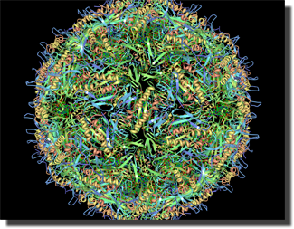

About RCSB Viewers
------------------

The *RCSB Viewers* suite of frameworks provides the capability of
creating 3-d viewing applications. The libraries are Java based, and
rely on *JOGL* (Java *OpenGL*) to do the 3d rendering. Currently, there
are four supported viewers implemented over the suite (see below.)

History
-------

The *RCSB Viewers* were initially implemented as a set of viewers over
the *MBT (Molecular Biology Toolkit) Library*, developed at the San
Diego Super Computing Center. The *MBT Library* provided the base-level
support for structure definition, loading, and viewing.

Since then, as part of a major re-architecting effort, the visualization
and application functionality have been lifted out of the *MBT Library*,
with a view towards replacing it with *BioJava*. As a result, the *MBT
Library* (renamed and factored in this distribution as the *RCSB MBT
Libs*) has been reduced to simply the structure definition and loading
frameworks - the UI application and 3d visualization frameworks have
been factored into discrete projects.

Current Viewers
---------------

The current set of viewers that are based on the framework are as
follows:

#### RCSB Simple Viewer

A basic viewer with no UI, except a menubar that allows for loading of
files and saving the current image to a file.

  
  

#### RCSB Protein Workshop

A viewer that provides tools to manipulate and examine parts of the
structure, as well as change the rendering styles.

  
  

#### RCSB Ligand Explorer

This viewer explores relationships between ligands (or other non-protein
chains/residues) and the containing protein.

  
  

#### RCSB PDB Kiosk

The *Kiosk* viewer is a full screen viewer that provides a slide show of
a set of structures, smoothly animating the camera for each structure
shown to view it from different angles and perspectives. It can also
focus on non-protein chains/residues, if present in the molecule.

Current Projects
----------------

The current primary projects defined for the *RCSB Viewers* are:

> RCSB MBT Libs  
> this project contains the modules to define and carry the 'model',
> defined as a set of structures. It has been mostly preserved directly
> from the original *MBT Library* project. It also contains modules to
> load files (currently only PDB and XML files are supported.) It is
> expected this will be replaced by *BioJava*.
>
> <!-- -->
>
> RCSB UIApp Framework  
> this project contains modules required to make an actual UI
> (windowing) application. It defines a singleton application class,
> mainframe (document frame) class, various controllers to tie the
> pieces together and direct program flow. The UI aspect is based on
> *Swing.*
>
> <!-- -->
>
> RCSB Viewer Framework  
> this is the project that carries the 3d modules and derived/modified
> classes to enable creation of 3d applications. The 3d rendering is
> provided by *JOGL (Java OpenGL)*, directly.
>
> <!-- -->
>
> RCSB Simple Viewer, RCSB Protein Workshop, RCSB Ligand Explorer, RCSB PDB Kiosk  
> projects for the end viewer applications.
>
In addition, there are several minor projects for updating datasets,
documentation, and tests. See the SVN repository for further
information.

Documentation
-------------

*Javadoc* documentation is generated from all the sources, and is
provided here (provide link.)

In addition, there are several operational/architectural topic pages as
follows:

### General:

-   [RCSB Viewers:Developer
    Environment](RCSB Viewers:Developer Environment "wikilink")
-   [Architectural
    Overview](RCSB Viewers:Architectural Overview "wikilink")
-   [Projects Overview](RCSB Viewers:Projects Overview "wikilink")
-   [Source Division](RCSB Viewers:Source Division "wikilink")

### RCSB MBT Libs:

-   [Bonds and Nucleic Acid
    Identification/Classification](RCSB Viewers:MBT Libs:Bonds and Nucleic Acid Identification^Classification "wikilink")
-   [Fragment (Secondary Structure)
    Definition](RCSB Viewers:MBT Libs:Fragment (Secondary Structure) Definition "wikilink")
-   [PDBToNdbConverter](RCSB Viewers:MBT Libs:PDBToNdbConverter "wikilink")

### RCSB Viewer Framework

-   [General
    Rendering](RCSB Viewers:Viewer Framework:General Rendering "wikilink")

