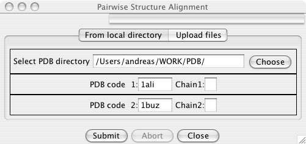
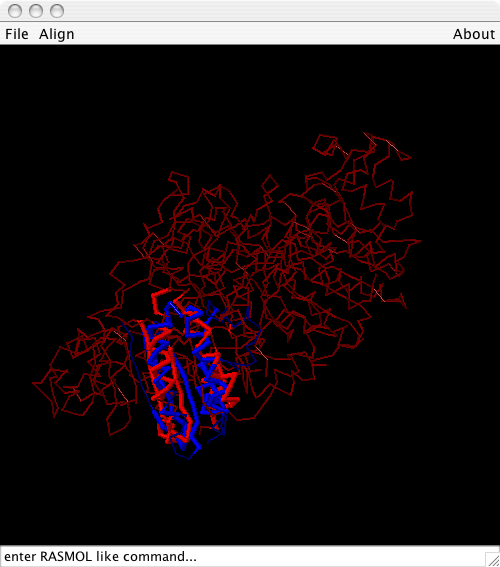
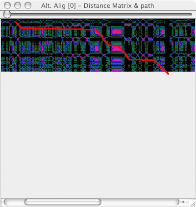

A simple GUI for protein structure alignment
============================================

BioJava (in SVN) contains a simple GUI for easier working with protein
structure alignments. The following code launches the user interface:

<java> import org.biojava.bio.structure.gui.\*;

public static void main(String[] args){

`   new AlignmentGui(); `

} </java>

The AlignmentGui
----------------

In the user interface specify 2 PDB files (and optionally chain IDs)
that should be superimposed.

After pressing the \*Submit\* button, the alignment is calculated. A new
frame pops up that shows the alternative solutions for this alignment:

Alternative Solutions
---------------------

The columns in this table are:

    #1    the number of the alternative alignment
    eqr   the number of structurally equivalent residues
    score the score for this alternative alignment
    rms   root mean sqare
    gaps  number of gaps in the alignment

Display in Jmol
---------------

The \*Show in Jmol\* button allows to display this alternative alignment
in Jmol, if it can be found on the classpath. If you don;t have Jmol
installed, please get it from
[<http://www.jmol.org>](http://www.jmol.org).

Internals of the algorithm
--------------------------

The \*Distance Matrix\* button shows the distance matrix that is used
internally for the alignment and the path that has been choosen.

Configure PDB installation (Optional)
-------------------------------------

If you have a PDB installation that contains all PDB files in a single
directory you can configure the System property PDB\_DIR to point to
this directory. (e.g. at startup specify -DPDB\_DIR=path/to/PDB/files )
