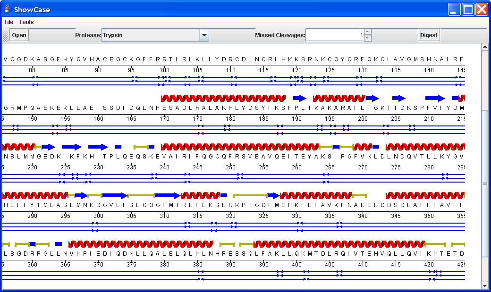

Comment afficher les caractéristiques d'une protéine avec les fragments d'une digestion tryptique (ou autre)?
-------------------------------------------------------------------------------------------------------------

**Note: cet exemple utilise des classes qui ne se trouvent pas dans
BioJava 1.4 mais dans le code CVS.**

L'exemple suivant montre plusieurs particularités de l'application
ProteinDigestDemo. Afin de profiter au maximum de cette démo, vous avez
besoin d'une séquence en format Swissprot contenant plusieurs éléments
d'information structurale dans sa table de *Features*.

The following link is for such a file:

    http://srs.ebi.ac.uk/srsbin/cgi-bin/wgetz?-id+465_c1S9c9A+-e+[SWISSPROT:'PPARG_HUMAN']+-qnum+1+-enum+2

Le code de cette recette accompli les 4 tâches suivantes:

**1) Affichage de la séquence sur plusieurs lignes**

`   Une protéine est typiquement affichée à une résolution d'un résidu/caractère (ou presque). Pour ce faire, nous utilisons un `*`SequencePanelWrapper`*` (package org.biojava.bio.gui.sequence) pour dessiner la séquence sur plusieurs pistes horizontales ou verticale sur la fenêtre. De cette manière, nous pouvons le plus possible de la séquence à la résolution désirée avec un look se rapprochant d'un article imprimé.`  
`   Le `*`SequencePanelWrapper`*` utilise différentes stratégies de mise en page via des classes implementant l'interface TrackLayout (package org.biojava.bio.gui.sequence.tracklayout). Une stratégie simple pour TrackLayout est de dessiné le même nombre de résidus par ligne. Une manière plus complexe est l'affichage d'un nombre différent pour chaque ligne. Cette situation pourrait se présenter par exemple si vous ne vouliez pas briser l'affichage d'un `*`Feature`*` sur plusieurs lignes.`

**2) Une règle permettant le décalage de la position 1**

`  Lorsque votre séquence démarre ailleurs qu'au début. Prenez par exemple une protéine portant une étiquette His ou HA en position amino-terminale. L'étiquette allonge la protéine en avant de sa position 1 native. Le système de coordonnées doit pouvoir accepter cette situtation.`

**3) Affichage des caractéristiques de structure secondaire (Hélices,
Replis, feuillets) et domaines**

`   Une séquence de format SwissProt peut inclure des caractéristiques de structure secondaire qui, à la suite de la lecture du fichier, se retrouvent dans la table des `*`Features`*`. Dans l'exemple ci-dessus, nous utilisons la classe GlyphFeatureRenderer (package org.biojava.bio.gui.sequence) et ces sous-classes (comme SecondaryStructureFeatureRenderer) pour dessiner des glyphes (HelixGlyph, TurnGlyph etc.) obtenu à partir du package org.biojava.bio.gui.glyph, qui sont eux-mêmes des implémentations de l'interface Glyph du même package.`

**4) Affichage d'une digestion peptidique**

`   L'exemple permet de d'associer le package org.biojava.bio.proteomics avec l'affichage graphique de la séquence. La classe-clé s'appelle `*`PeptideDigestRenderer`*` (package org.biojava.bio.gui.sequence). Nous utilisons la classe `*`Digest`*` du package org.biojava.bio.proteomics pour créer des caractéristiques de type Digest.PEPTIDE_FEATURE_TYPE pour ensuite les filtrer avec `*`PeptideDigestRenderer`*`. `*`PeptideDigestRenderer`*` est une sous-classe de `*`MultiLineRenderer`*` et effectue le tri est l"alignement des caractéristiques pour qu'ils ne se chevauchent pas dans la fenêtre d'affichage, créant des lignes supplémentaires au besoin. Le rendu des ces caractéristiques est très flexible en redéfinissant la méthode de la classe parente `**`public`
`FeatureRenderer` `createRenderer(int`
`lane)`**` pour des affichages personnalisés.`

------------------------------------------------------------------------

------------------------------------------------------------------------

<java> import org.biojava.bio.\*; import org.biojava.bio.symbol.\*;
import org.biojava.bio.gui.sequence.\*; import
org.biojava.bio.gui.sequence.tracklayout.\*; import
org.biojava.bio.gui.glyph.\*; import org.biojava.bio.seq.\*; import
org.biojava.bio.seq.impl.\*; import org.biojava.bio.seq.io.\*; import
org.biojava.utils.\*; import org.biojava.bio.proteomics.\*;

import java.io.\*; import javax.swing.\*; import java.awt.\*; import
java.awt.event.\*; import java.util.\*;

/\*\*

`* PeptideDigestDemo démontre L'utilisation de plusieurs nouveaux SequenceRenderers et de `  
`* quelques mises en page des séquences.`  
`* La classe SequencePanelWrapper permet l'affichage de style "page" d'une séquence SwissProt`  
`* avec ces caractéristiques structurales (Alpha Helices, Beta Sheets and Domains) rendus graphiquement.`  
`* L'usage du package org.biojava.bio.proteomics est aussi démontré par le biais du `  
`* PeptideDigestRenderer.`  
`* `

`*`  
`* @author `<a href="mailto:mrsouthern@hotmail.com">`Mark Southern`</a>  
`* @since 1.4`  
`*/`

public class PeptideDigestDemo extends JFrame{

`   private MultiLineRenderer multi;`  
`   private SequencePanelWrapper sequencePanel;`  
`   private Sequence seq;`  
`   private PeptideDigestRenderer digestRenderer;`  
`   private OffsetRulerRenderer offsetRenderer;`  
`   private JToolBar toolBar;`  
`   private JMenuBar menuBar;`  
`   `  
`   public PeptideDigestDemo(){`  
`       setTitle("ShowCase");`  
`       `  
`       configureSequencePanel();`  
`       `  
`       Action action = new OpenSequenceAction();`  
`       `  
`       toolBar = new JToolBar();`  
`       getContentPane().add(toolBar, BorderLayout.NORTH);`  
`       toolBar.add( new JButton( action ) );`  
`       toolBar.add( new JSeparator());`  
`       `  
`       menuBar = new JMenuBar();`  
`       setJMenuBar(menuBar);`  
`       JMenu menu = new JMenu("File");`  
`       menuBar.add(menu);`  
`       menu.add( new JMenuItem( action ) );`  
`       `  
`       configureProteaseCombo();`  
`       `  
`       menu = new JMenu("Tools");`  
`       menuBar.add(menu);`  
`       `  
`       action =new OffsetAction();`  
`       menu.add(new JMenuItem( action ));   `  
`       action =new SmoothTrackWrapAction();`  
`       menu.add(new JMenuItem( action ));`  
`       action = new UserDefinedTrackWrapAction();`  
`       menu.add(new JMenuItem( action ));`  
`       `  
`       setDefaultCloseOperation(WindowConstants.DISPOSE_ON_CLOSE);`  
`       getContentPane().add(new JScrollPane(sequencePanel), java.awt.BorderLayout.CENTER);        `  
`       pack();`  
`       setSize(800, 800);`  
`   }`  
`   `  
`   protected void configureSequencePanel(){`  
`       sequencePanel = new SequencePanelWrapper();`  
`       sequencePanel.setSequence(seq);`  
`       MultiLineRenderer multi = new MultiLineRenderer();`  
`       sequencePanel.setRenderer(multi);`  
`       `  
`       try{`  
`           multi.addRenderer( createDomainRenderer() );`  
`           multi.addRenderer( createSecondaryStructureRenderer() );`  
`           multi.addRenderer(new SymbolSequenceRenderer());`  
`           multi.addRenderer( offsetRenderer = new OffsetRulerRenderer());`  
`           multi.addRenderer( createPeptideDigestRenderer() );`  
`       }`  
`       catch(ChangeVetoException ex){`  
`            ex.printStackTrace();`  
`       }`  
`   }`  
`   `  
`   protected void configureProteaseCombo(){`  
`       final JComboBox proteaseCombo = new JComboBox( new DefaultComboBoxModel() );`  
`       Object selected = proteaseCombo.getSelectedItem();`  
`       ((DefaultComboBoxModel)proteaseCombo.getModel()).removeAllElements();`  
`       int idx = -1;`  
`       int i = 0;`  
`       for(Iterator it = new TreeSet( ProteaseManager.getNames() ).iterator(); it.hasNext(); ){`  
`           String protease = (String)it.next();`  
`           if( protease.equals(selected))`  
`               idx = i;`  
`           i++;`  
`           proteaseCombo.addItem(protease);`  
`       }`  
`       toolBar.add( new JLabel("Protease:") );`  
`       toolBar.add( proteaseCombo );`  
`       toolBar.add( new JSeparator());`  
`       toolBar.add( new JLabel("Missed Cleavages:"));`  
`       final JSpinner missedCleavages = new JSpinner( new SpinnerNumberModel(0,0,10,1));`  
`       toolBar.add( missedCleavages );`  
`       toolBar.add( new JSeparator());`  
`       JButton b = new JButton( new AbstractAction("Digest"){`  
`           public void actionPerformed(ActionEvent e){`  
`               try{`  
`                   ViewSequence view = new ViewSequence(seq);`  
`                   Digest digest = new Digest();`  
`                   digest.setSequence( view );`  
`                   String proteaseName = proteaseCombo.getSelectedItem().toString();`  
`                   digest.setProtease( ProteaseManager.getProteaseByName(proteaseName) );`  
`                   int max = ((Integer)missedCleavages.getValue()).intValue();`  
`                   digest.setMaxMissedCleavages(max);`  
`                   digest.addDigestFeatures();`  
`                   setViewSequence(view);`  
`                   digestRenderer.sortPeptidesIntoLanes();`  
`               }`  
`               catch(Exception ex){`  
`                   JOptionPane.showMessageDialog((Component)e.getSource(),"There was an error digesting the protein","Demo", JOptionPane.ERROR_MESSAGE);`  
`               }`  
`           }`  
`       });`  
`       toolBar.add(b);`  
`       toolBar.add( new JSeparator());`  
`   }    `

`   protected SequenceRenderer createSecondaryStructureRenderer() throws ChangeVetoException{`  
`       SecondaryStructureFeatureRenderer fr = new SecondaryStructureFeatureRenderer();`  
`       FeatureBlockSequenceRenderer block = new FeatureBlockSequenceRenderer();`  
`       block.setFeatureRenderer(fr);`  
`       return block;`  
`   }`  
`   `  
`   protected SequenceRenderer createDomainRenderer() throws ChangeVetoException{`  
`       GlyphFeatureRenderer gfr = new GlyphFeatureRenderer();`  
`       gfr.addFilterAndGlyph(new FeatureFilter.ByType("DOMAIN"),`  
`               new TurnGlyph(java.awt.Color.GREEN.darker(), new java.awt.BasicStroke(3F))`  
`       );`  
`       FeatureBlockSequenceRenderer block = new FeatureBlockSequenceRenderer();`  
`       block.setFeatureRenderer(gfr);`  
`       return block;`  
`   }`  
`   `  
`   protected SequenceRenderer createPeptideDigestRenderer() throws ChangeVetoException{`  
`       digestRenderer = new PeptideDigestRenderer( new FeatureSource(){ `  
`           public FeatureHolder getFeatureHolder(){`  
`               return sequencePanel.getSequence();`  
`           }`  
`       });`  
`       digestRenderer.setFilter( new FeatureFilter.ByType( Digest.PEPTIDE_FEATURE_TYPE ) );`  
`       return digestRenderer;`  
`   }`  
`   `  
`   protected void setViewSequence(ViewSequence seq){`  
`       sequencePanel.setSequence(seq);`  
`   }`  
`   `  
`   public static void main(String[] args) throws IOException, BioException, ChangeVetoException{`  
`       PeptideDigestDemo s = new PeptideDigestDemo();`  
`       s.setVisible(true);`  
`   }`  
`   `  
`   class OpenSequenceAction extends AbstractAction{`  
`       public OpenSequenceAction(){`  
`           super("Open");`  
`       }`  
`       public void actionPerformed(ActionEvent e){`  
`           JFileChooser chooser = new JFileChooser();`  
`           int result = chooser.showOpenDialog((Component)e.getSource());`  
`           if( result != JFileChooser.APPROVE_OPTION )`  
`               return;`  
`           File f = chooser.getSelectedFile();`  
`           try{`  
`               SequenceIterator iter = ( SequenceIterator ) SeqIOTools.fileToBiojava(SeqIOTools.guessFileType(`  
`                   f), new BufferedReader(new FileReader(f))`  
`               );`  
`               seq = iter.nextSequence();`  
`               setViewSequence(new ViewSequence(seq));`  
`           }`  
`           catch(Exception ex){`  
`               JOptionPane.showMessageDialog((Component)e.getSource(), "There was an error opening the sequence","Demo", JOptionPane.ERROR_MESSAGE);`  
`           }`  
`       }`  
`   }`  
`   `  
`   class OffsetAction extends AbstractAction{`  
`       public OffsetAction(){`  
`           super("Set Ruler Offset");`  
`       }`  
`       public void actionPerformed(ActionEvent e){`  
`           String result = JOptionPane.showInputDialog((Component)e.getSource(), "Enter an offset for the ruler","Demo", JOptionPane.QUESTION_MESSAGE);`  
`           try{`  
`               int i = Integer.parseInt(result);`  
`               offsetRenderer.setSequenceOffset(i);`  
`           }`  
`           catch(Exception ex){`  
`               JOptionPane.showMessageDialog((Component)e.getSource(), "There was an error setting the ruler","Demo", JOptionPane.ERROR_MESSAGE);`  
`           }`  
`       }`  
`   }`

`   class SmoothTrackWrapAction extends AbstractAction{`  
`       public SmoothTrackWrapAction(){`  
`           super("Smooth Track Wrapping");`  
`       }`  
`       public void actionPerformed(ActionEvent e) {`  
`           String result = JOptionPane.showInputDialog((Component)e.getSource(),`  
`                   "Enter a single value on which to wrap");`  
`           try{`  
`               int i = Integer.parseInt(result);`  
`               sequencePanel.setTrackLayout(new SimpleTrackLayout(sequencePanel.getSequence(),i));`  
`           }`  
`           catch(Exception ex){`  
`               JOptionPane.showMessageDialog((Component)e.getSource(), "There was an error setting the wrapping","Demo", JOptionPane.ERROR_MESSAGE);`  
`           }`  
`       }`  
`   }`  
`   `  
`   class UserDefinedTrackWrapAction extends AbstractAction{`  
`       public UserDefinedTrackWrapAction(){`  
`           super("Set User Defined Track Wrapping");`  
`       }`  
`       public void actionPerformed(ActionEvent e) {`  
`           TrackLayout tl = sequencePanel.getTrackLayout();`  
`           RangeLocation[] ranges = tl.getRanges();`  
`           String expr = "";`

`           for (int i = 0; i < ranges.length; i++) {`  
`               expr += ranges[i].getMax();`

`               if (i < ranges.length) {`  
`                   expr += ",";`  
`               }`  
`           }`

`           expr = JOptionPane.showInputDialog((Component)e.getSource(),`  
`                   "Enter the values on which to wrap (comma separated)", expr`  
`               );`

`           if (expr == null) {`  
`               return;`  
`           }`

`           String[] nums = expr.split("[\\s,\\t]+");`  
`           ranges = new RangeLocation[nums.length];`

`           int min = 1;`

`           for (int i = 0; i < nums.length; i++) {`  
`               int max = Integer.parseInt(nums[i]);`  
`               ranges[i] = new RangeLocation(min, max);`  
`               min = max + 1;`  
`           }`

`           sequencePanel.setTrackLayout(new UserDefinedTrackLayout(ranges));`  
`       }`  
`   }`

} </java>
