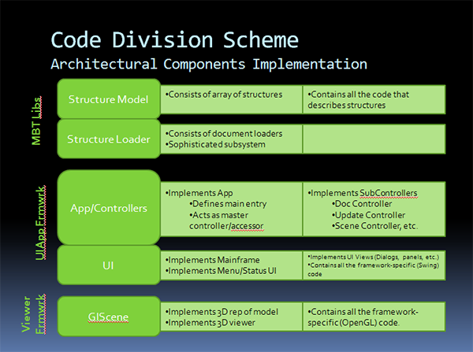

We need to organize the source in such a way that we know how and where
to find things. To a certain extent, we can do this with package
namespaces, but when we get a lot of packages, things can become a bit
blurry.

Note that <em>source division</em> simply describes how the source is
divided up, not specifically any architectural divisions (although there
is some corollary - see below.

Approach
--------

We can use the Eclipse <em>Source Directory</em> feature to divide the
source into larger, very apparent divisions.

Source basically falls into five recognizable major categories. These
are listed here, along with the architectural groups that fall within
them:

  
  

While these tend to mostly follow architectural lines, two divisions
follow toolkit implementation lines, specifically the *UI* and *GL
Scene* divisions.

This is because they are each implemented with a toolkit -
<em>Swing</em> and <em>OpenGL</em> respectively. We want to isolate
these specifically, to allow us to replace them, should we desire. Also,
we can use this as a check to see if too much controller/model or other
application internal implementation is creeping in here.

Ideally, these code divisions should:

-   Be the <em>only</em> place where the implementing toolkit code
    resides.
-   Contain as little application-implementation code as possible.

Note in the case of the <em>GL Scene</em>, this is currently not the
case - in the future, we may want to break this down into <em>Scene</em>
and <em>GL Scene</em> for generic scene implementation (if there is such
a thing) and <em>OpenGL</em>-scene implementation, respectively.

Note that the source division described here is mirrored in all the
projects. Thus, if a viewer app wants to derive a controller that is
defined in a support library, that app should locate that source (and
the appropriate package name) in the same named folder as the base class
is contained in the support lib.

Package Naming Convention
-------------------------

Packages are currently prefaced with org.rcsb.\*. After that initial
organization identifier, the packages are identified with a 'n' letter
code, depending on which project it belongs to:

-   *mbt* - MBT Libs project
-   *uiApp* - UIApp Framework project
-   *vf* - Viewer Framework project
-   *sv* - Simple Viewer project
-   *pw* - Protein Workshop project
-   *lx* - Ligand Explorer project
-   *ks* - Kiosk Viewer project

New libraries or applications should add their own identifying code to
the package namespace.

Extra Division - Structure Loader
---------------------------------

The <em>Structure Loader</em> is a fairly large subsystem in and of
itself - thus it seemed appropriate to put it in its own division.</a>
In architectural terms, technically, it could be considered part of the
<em>DocController</em>, but breaking it out keeps it all together as a
mechanism <em>used</em> by the <em>DocController</em> without cluttering
up that code with too much detail.

Jar Division Reflects Projects Division
---------------------------------------

Ultimately the MBT is output to one or more jars for loading into an
application. An application shouldn't have to load any more code than it
needs - thus, the multiple jars are created reflecting the code
division.

Each project represents a jarfile. Thus, a UI only app, does not need
the functionality provided in the *Viewer Framework*, a command-line
analysis tool does not need the functionality provided in either the
*UIApp Framework* or the *Viewer Framework.*
